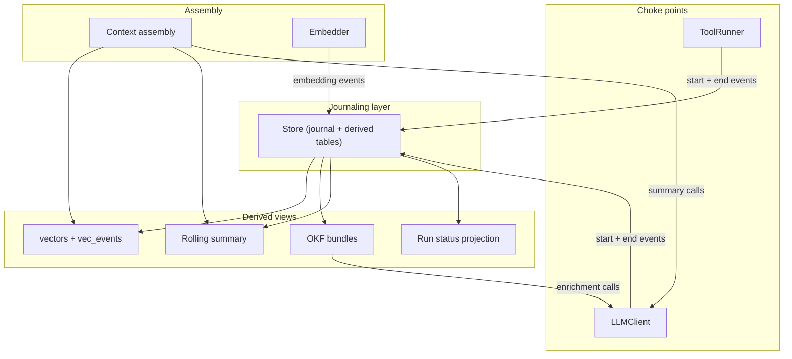

# Architecture

## Component map



### Store

The persistence layer. Owns the events table (the journal), the vectors table, and the vec_events search index. Enforces immutability via database triggers. Provides append, query, vector upsert, search, and rebuild operations. Depends on nothing except SQLite. Does not interpret event semantics — it stores and retrieves.

### LLMClient

The journaling choke point for all LLM interactions. Every model call in the system is routed through this single class so that nothing goes un-journaled. Emits a start event before the provider call and an end event after (with `status="ok"` on success or `status="error"` on failure). Delegates wire-format translation to provider adapters but owns the journaling contract. Depends on Store and the provider adapter registry.

### ToolRunner

The equivalent choke point for tool execution. Wraps any callable, journals start and end events (including error events on exception), measures latency, then re-raises. Depends on Store. Does not know what tools exist — it journals the execution of whatever it's given.

### Embedder

Translates text into vector embeddings via a pluggable provider backend. Stateless — it embeds text and reports its provider name and model identity so callers can record provenance. Does not interact with the journal directly; the Store records embedding events when vectors are written.

### Context assembly

Builds per-turn context from two sources: vector retrieval (weighted by provenance, tie-broken by recency) and a rolling summary. Consumes Store for search and LLMClient for summary generation. Owns the provenance-weighting logic and the self-contamination guard (excludes system-generated summaries from its own input). Does not own the summary's storage — it regenerates on demand from the journal.

### Run lifecycle

Manages agent run state as a series of `agent_run` journal events (started, resumed, terminal). Provides run-status projections computed on read — never as stored mutable state. Provides a reconciliation operation that detects crashed runs by checking event staleness against a threshold. Depends on Store.

### OKF enrichment

The knowledge-extraction layer above the raw journal. Takes assistant responses, uses an LLM to produce concise summaries, embeds them, and writes the results as both files and vectors. Sits above everything else — consumes LLMClient (for enrichment calls), Embedder (for vectorization), and Store (for vector persistence). All its outputs are derived and rebuildable.

## Data flow

### An LLM call's lifecycle

1. Caller invokes `LLMClient.call()` with messages, model, and provider.
2. A start event is appended to the journal (`phase="started"`), durably committed.
3. The provider adapter translates the request to wire format; the HTTP call executes.
4. On success: the adapter normalizes the response; an end event is appended (`status="ok"`, `phase="completed"`) with token counts, cost, and latency.
5. On failure: an error end event is appended (`status="error"`, `phase="failed"`) capturing the exception, then the exception re-raises.
6. Both paths commit the end event before returning or raising — no dangling start events.

The start and end events share a `root_id` (for run-level grouping) and are linked by `parent_id` (end event points to start event).

### The embedding flow

1. Caller embeds text via the Embedder, receiving a vector.
2. Caller invokes `Store.upsert_vector()` with the event ID, the verbatim embedded text, the vector, and the embedding provider/model as recorded from the Embedder instance.
3. Inside a single transaction (no intermediate commits):
   - An `event_type="embedding"` event is appended to the journal, carrying the exact text in its content field and the provider/model in its metadata fields.
   - The vector is written to the vectors table.
   - If the vec0 search extension is loaded, the vector is written to vec_events.
4. One commit makes all three writes atomic — if any step fails, none persist.

The embedding event in the journal is what makes vector reconstruction faithful: it records not just that an embedding happened, but exactly what was embedded and with which model.

## The derived-view rebuild model

The dependency direction is strict and acyclic:

```
events (immutable journal)
  │
  ├── embedding events ──► vectors ──► vec_events
  │
  ├── agent_run events ──► run status (computed on read, not stored)
  │
  ├── assistant events ──► rolling summary (regenerated on demand)
  │
  └── assistant events ──► OKF enrichment ──► OKF bundles (files)
                                          └──► vectors (via embedding flow)
```

**Rebuild directions:**

- **vec_events** can be rebuilt from **vectors** — `rebuild_vec_index()` drops and repopulates the vec0 virtual table from the vectors table's stored embeddings.
- **vectors** can be rebuilt from the **journal** — `rebuild_vectors_from_journal()` scans embedding events, groups by provider, re-instantiates the correct Embedder for each, re-embeds the journaled text, and repopulates vectors. Then triggers vec_events rebuild.
- **Rolling summary** is never stored — it's regenerated from journal events on each call.
- **Run status** is never stored — it's projected from `agent_run` events on read.
- **OKF bundles** can be regenerated by re-running the enrichment pipeline over journal events.

Each rebuild path uses information recorded at write time (the embedding model identity, the verbatim text) rather than re-deriving from assumptions. This is what makes rebuilds faithful rather than approximate.

## Provider abstraction boundary

The system interacts with multiple LLM providers (OpenAI, Google, Groq) and multiple embedding providers (Google, Ollama, HuggingFace, sentence-transformers). The adapter pattern is the one earned abstraction — it exists because there are genuinely multiple implementations from day one, not speculatively.

**LLM adapters** sit behind the LLMClient. Each adapter translates between a canonical request format (model, messages, temperature) and the provider's wire format, and normalizes responses back. The LLMClient doesn't know how to talk to any specific provider — it delegates to the adapter and journals the canonical result.

**Embedding adapters** sit behind the Embedder. Each adapter knows how to call its provider's embedding endpoint and returns a float vector. The Embedder exposes a uniform `embed(text) -> list[float]` interface plus `provider_name` and `model_name` for provenance recording.

The boundary is deliberate: everything above the adapters works in canonical types (dicts, float lists). Everything below speaks a specific provider's API. The adapter is the only place that knows about provider-specific wire formats, authentication patterns, or response structures.
