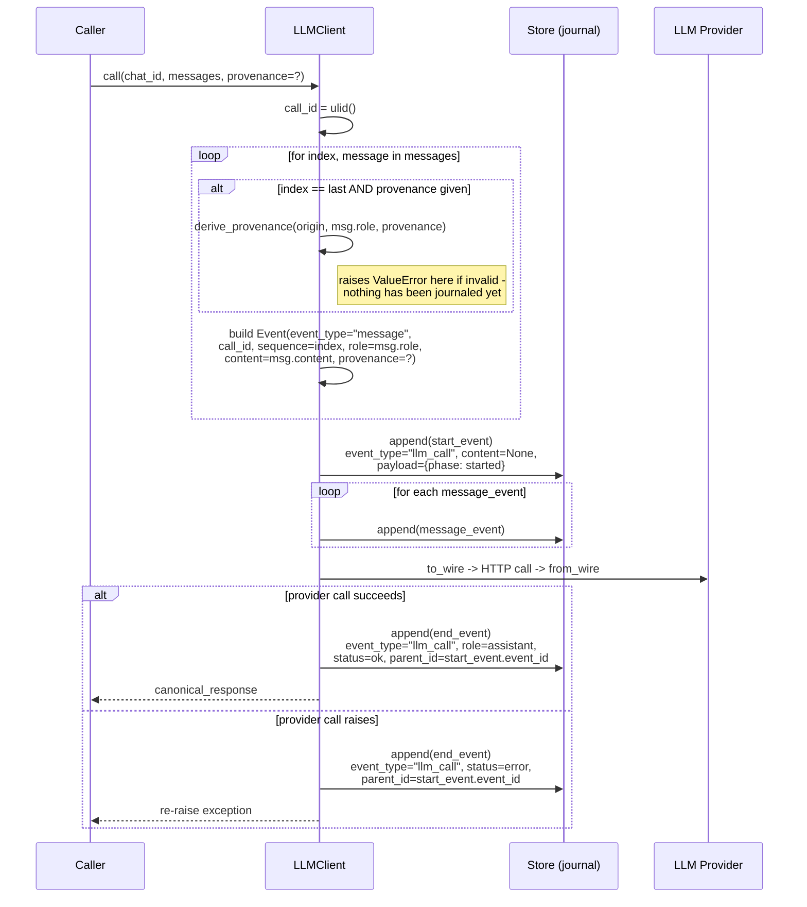
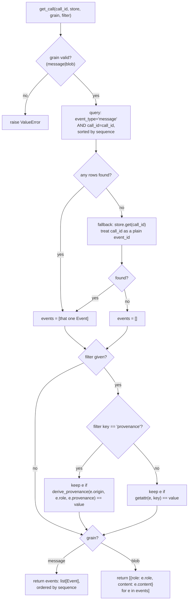
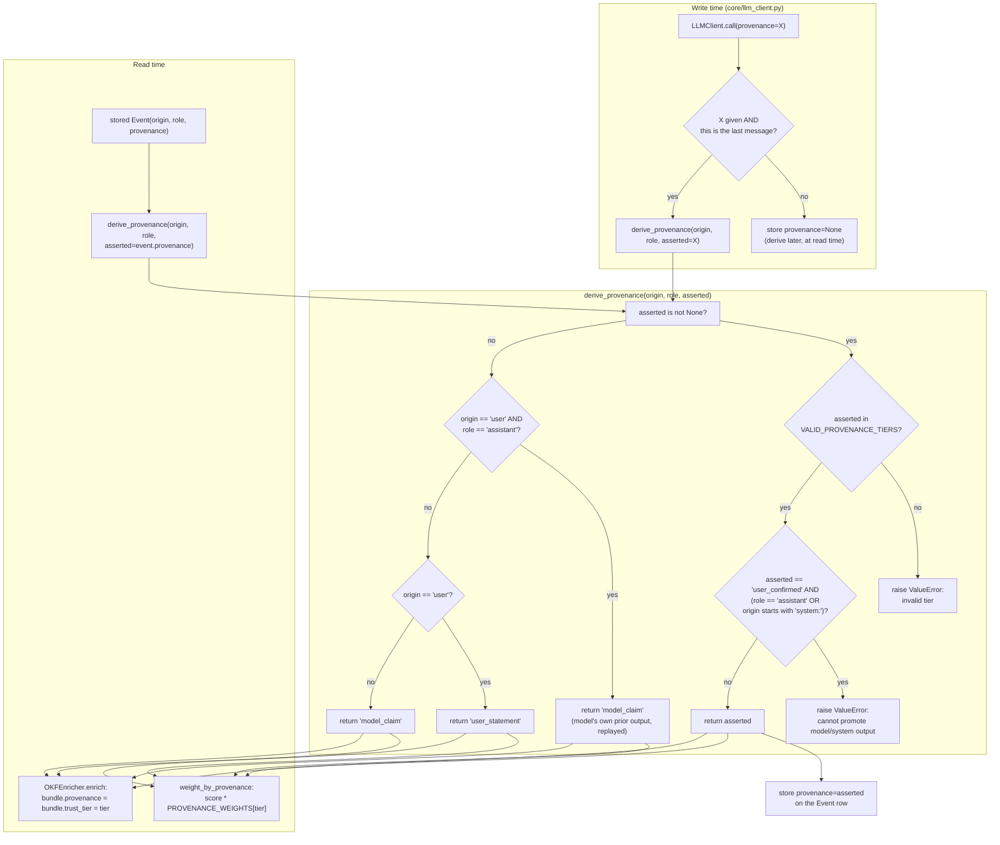

# Diagrams

Three diagrams of the current write/read/provenance flow. Each is grounded in the
file:line references given below it — if the code moves, regenerate the diagram from
the code, not from this file.

## (a) Write path: message split into per-row journal entries

Grounded in `LLMClient.call()` ([core/llm_client.py:40-198](../core/llm_client.py#L40-L198)). Validation of any
asserted `provenance` happens during message-row construction, before the first
`store.append()` call — an invalid assertion fails clean with nothing journaled yet.

Note what's *not* new here: the `llm_call` start/end events keep their existing
shape and purpose (crash detection via the dangling-start-event pattern, `parent_id`
linking). Only the start event's `content` changed (blob → `None`); `call_id` and
`sequence` exist exclusively on the new `event_type="message"` rows.

## (b) Read path: `get_call()`'s modes

Grounded in `get_call()` ([handshake/context_assembler.py:24-65](../handshake/context_assembler.py#L24-L65)).

The "no rows found" fallback path (`D -- no -->`) is load-bearing today: vector-search
hits passed into `weight_by_provenance()` are still keyed to `llm_call`/`embedding`
event ids, not `call_id`s, since nothing yet embeds individual `message` rows. Without
the fallback, every retrieval hit would resolve to an empty event list. See
[DECISIONS.md](../DECISIONS.md) for the rationale and the debt this leaves behind.

## (c) Provenance derivation flow

Grounded in `derive_provenance()` ([core/provenance.py:6-25](../core/provenance.py#L6-L25)), its write-side caller in
`LLMClient.call()` ([core/llm_client.py:69-71](../core/llm_client.py#L69-L71)), and its read-side callers
`weight_by_provenance()` ([handshake/context_assembler.py:82](../handshake/context_assembler.py#L82)) and
`OKFEnricher.enrich()` ([handshake/okf_enrichment.py:32](../handshake/okf_enrichment.py#L32)).

The write-time and read-time paths both funnel through the same `derive_provenance()`
— there is exactly one place in the codebase that decides what a tier resolves to,
and exactly one invariant (`D3`/`D4`) that a caller cannot bypass by asserting.
